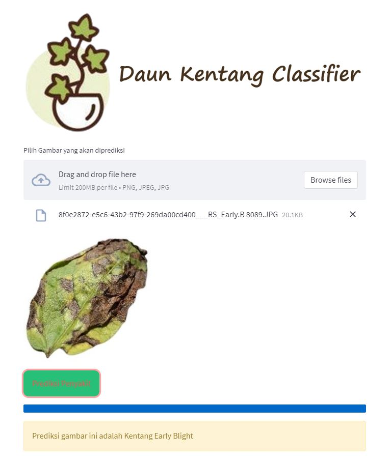

# Skripsi-CNN-Daun-Kentang

    <strong>🎓&nbsp; Klasifikasi Penyakit pada Daun Kentang Menggunakan Pengolahan Citra dengan Metode Convolutional Neural Network (CNN)</strong>

    
    

---

## 🔍 Masalah di Lapangan

1. Petani kentang belum dapat memaksimalkan proses budidaya kentang.
2. Tidak banyak pakar kentang yang dapat ditemui sehari-hari,serta literatur yang sulit dijangkau.

## 🚀 Solusi: Deep Learning

Klasifikasi citra daun tanaman kentang menggunakan teknologi Deep Learning - Convolutional Neural Network (CNN) dapat membantu petani kentang dalam mengidentifikasi penyakit pada tanaman kentang.

## ⚠️ Batasan Aplikasi

Citra yang dapat diklasifikasikan oleh sistem hanya 3 citra daun kentang yang umum ditemukan, yaitu Early Blight, Late Blight, dan Healthy.Citra memiliki kriteria sebagai berikut: 
1. Penyakit Early Blight dengan ciri khas adanya bercak daun dengan corak "bullseye".
2. Penyakit Early Blight ini ditandai dengan bercak coklat hingga hitam. Bercak akan muncul di ujung dan kemudian menyebar ke seluruh daun.
3. Daun kentang sehat atau Healthy tidak memiliki bercak.

## 🌐 Tampilan Demo Aplikasi

